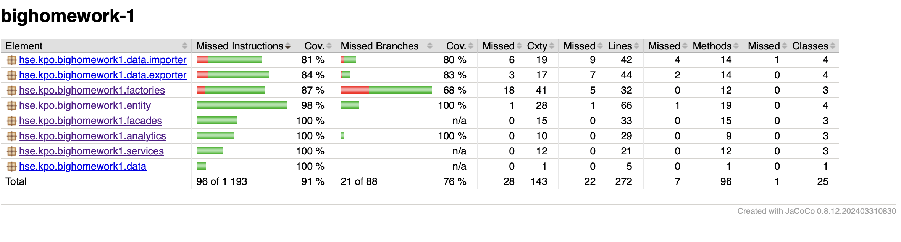

# Большое Дз-1
Леонидов Максим Владимирович БПИ232-1
## Общая идея решения

Разработано консольное приложение для управления финансами пользователей, включающее:

- Создание, редактирование и удаление счетов (BankAccount), категорий (Category) и операций (Operation).

- Аналитику (разница доходов и расходов, группировка по категориям).

- Импорт и экспорт данных в форматы CSV, YAML, JSON.

- Управление данными, включая пересчет баланса при несоответствиях.

- Замер времени выполнения пользовательских сценариев.

Программа реализована с учетом принципов SOLID, GRASP и паттернов проектирования GoF.

# Информация о классах
## Entity
### BankAccount
Класс, который описывает сущность BankAccount, имеет поля id,name,balance (в копейках для удобства формирования операций).
Также в каждом классе сущностей реализован метод exportData, который позволяет выборочно экспортировать данные 
в нужных форматах, если какой либо формат не реализован для экспорта, бросается исключение.
### Category
Класс, который описывает сущность Category (категория операции), имеет поля

- Integer id; - id категории
- CategoryType type; -тип категории
- String name; -имя категории

Также в каждом классе сущностей реализован метод exportData, который позволяет выборочно экспортировать данные
в нужных форматах, если какой либо формат не реализован для экспорта, бросается исключение.
### Operation
Класс, который описывает операции в банке,
Также в каждом классе сущностей реализован метод exportData, который позволяет выборочно экспортировать данные
в нужных форматах, если какой либо формат не реализован для экспорта, бросается исключение.
### Exportable (Interface)
Интерфейс, который наделяет класс возможностью экспорта данных, имеет метод для реализации export()
### CategoryType
Перечисление, содержит в себе тип категории (Доход или Расход)

## Services
### IStorage (Interface)
Интерфейс, который наделяет класс способностью хранить данные, добавлять/удалять, имеет методы

- Map<Integer,TParam> getStorage(); - получить данные
- void add(TParam p); -добавить данные
- void delete(int index); - удалить данные
### BankAccountStorage
Класс для хранения BankAccount
### CategoryStorage
Класс для хранения Category
### OperationStorage
Класс для хранения Operation

## Factories
### BankAccountFactory
Класс для создания BankAccount. Имеет методы:
- public BankAccount createAccount(String name, Integer balance) - используется для создания нового BankAccount с новым id
- public BankAccount createAccount(Integer id, String name, Integer balance) -используется в фасаде для обновления существующего BankAccount
Также кидают исключения, если формат не соответствует требованиям
### CategoryFactory
Класс для создания Category, работает аналогично BankAccount
### OperationFactory
Класс для создания Operation, работает аналогично BankAccount
## Facades
### BankAccountFacade
Класс, который содержит в себе всю работу с BankAccount, имеет методы
- create - создать и положить на хранение объект BankAccount
- get - получить все объекты BankAccount
- delete - удалить по id объект BankAccount
- update - обновить существующий объект BankAccount
- ### CategoryFacade
Класс, который содержит в себе всю работу с Category (работает аналогично BankAccountFacade)
- ### OperationFacade
Класс, который содержит в себе всю работу с Operation (работает аналогично BankAccountFacade)

## data.exporter
Общий принцип работы такой: Каждый формат для экспорта (JsonExporter, CSVExporter, YamlExporter) наследуют 
интерфейс IDataExporter, который наделяет формат возможностью экспорта. Интерфейс содержит методы:
- void export(Map<Integer, ? extends Exportable> data, String filePath)throws IOException; - реализуется логика экспорта
- ReportFormat getFormat(); - для получения формата экспорта, чтобы в методе export передать формат в сущность (так как в каждой сущности по своему реализуется экспорт данных)

Также есть IDataManagerExporter, общий интерфейс менеджера экспортеров. Его реализует класс DataManagerExporter - единая точка хранения и вызова любого экспортера
## data.importer
Принцип работы: Все импортеры наследуются от Абстрактного класс DataImporter. Главный метод importData который вызывает 
3 абстрактных метода readFile,parseData,processData - их реализуют конкретные импортеры
## ReportFormat
Содержит перечисление всех доступных форматов для импорта или экспорта
## analytics
### Command
Интерфейс, который содержит метод execute(), его реализуют все классы для аналитики данных
### BalanceCalculationCommand
Подсчитывает разнице доходов и расходов для всех BankAccount
### GroupByCategoryCommand
Подсчитывает сумму операций по всем категориям
### TimedCommand
В конструкторе принимает Command, при вызове execute, помимо основной аналитики, подсчитывает время работы подсчета

## Application

Main класс, точка входа в программу

## Принципы SOLID и GRASP

### Single Responsibility Principle (SRP)

Каждый класс отвечает только за одну задачу:

BankAccount – хранит данные о банковском счете.

Operation – представляет собой отдельную операцию (доход или расход).

BankAccountStorage – управляет хранением счетов.

CsvExporter, JsonExporter, YamlExporter – отвечают за экспорт данных в конкретный формат.

BalanceCalculationCommand – выполняет подсчет разницы доходов и расходов.

### Open-Closed Principle (OCP)

Код открыт для расширения, но закрыт для модификации:

Новые форматы экспорта могут быть добавлены через реализацию IDataExporter без изменения существующего кода.

Расширение логики аналитики возможно через создание новых команд, реализующих Command.

### Liskov Substitution Principle (LSP)

Подклассы могут заменять базовые классы без изменения поведения программы:

Все экспортеры (CsvExporter, JsonExporter, YamlExporter) могут заменять друг друга, так как реализуют IDataExporter.

Разные типы DataImporter (JsonImporter, CsvImporter) могут использоваться взаимозаменяемо.

### Interface Segregation Principle (ISP)

Разбиение интерфейсов на мелкие, специализированные:

IDataExporter и IDataImporter разделяют ответственность за экспорт и импорт данных.

IStorage обеспечивает абстрактный доступ к хранилищам для разных типов данных (BankAccount, Operation, Category).

### Dependency Inversion Principle (DIP)

Высокоуровневые модули не зависят от низкоуровневых:

DataManagerExporter использует интерфейс IDataExporter, а не конкретные реализации, что делает код гибким.

Фасады (BankAccountFacade, CategoryFacade, OperationFacade) зависят от интерфейсов IStorage, а не от конкретных классов хранилищ.

### High Cohesion & Low Coupling (GRASP)

High Cohesion – каждый класс имеет четкую специализацию (например, CsvExporter отвечает только за экспорт в CSV, а CategoryStorage – только за хранение категорий).

Low Coupling – классы слабо связаны между собой, благодаря использованию интерфейсов и паттернов (фасад, команда, фабрика).
## Использованные паттерны проектирования

- Фасад (Facade) – объединяет операции с банковскими счетами, категориями и операциями (BankAccountFacade, CategoryFacade, OperationFacade).

- Команда (Command) + Декоратор (Decorator) – каждая операция оформлена в виде команды (BalanceCalculationCommand, GroupByCategoryCommand), а декоратор (TimedCommand) измеряет время выполнения.

- Шаблонный метод (Template Method) – используется при импорте данных (JsonImporter, CsvImporter, YamlImporter наследуются от DataImporter).

- Посетитель (Visitor) – реализован для экспорта данных в разные форматы (конкретные данные для экспорта реализуются в сущностях, 
далее в IDataExporter в методе export реализуется общая логика и для каждого элемента вызывается метод export). То есть какой то конкретный экспортер посещает сущность 
и вызывает ее реализацию метода export.

- Фабрика (Factory Method) – фабричные методы используются для создания объектов (BankAccountFactory, CategoryFactory, OperationFactory), предотвращая дублирование кода и ошибки валидации.

Всего реализовано 6 паттернов проектирования

## Di контейнер
В программе используются Di контейнеры библиотеки Spring. С помошью autowired находятся Bean 
класса и внедряются зависимости.

## Тесты

Покрытие тестами составляет более 65% кода, можно проверить при помощи плагина jacoco
прописав ./gradlew clean build и получив отчет в папке build/jacocoHtml/index.html

